```markdown
<div align="center">


# NeuraLab.AI
### The Adaptive, Generative Educational Platform

[](https://react.dev/)
[](https://www.typescriptlang.org/)
[](https://vitejs.dev/)
[](https://tailwindcss.com/)
[](https://deepmind.google/technologies/gemini/)
[](./LICENSE)

<p align="center">
  <a href="#-overview">Overview</a> •
  <a href="#-key-features">Features</a> •
  <a href="#-system-architecture">Architecture</a> •
  <a href="#-getting-started">Getting Started</a> •
  <a href="#-roadmap">Roadmap</a>
</p>

</div>

---

## 🧠 Overview

**NeuraLab.AI** is a state-of-the-art educational platform that fundamentally shifts learning from static content consumption to **dynamic, generative interaction**. By leveraging the **Google Gemini 2.5 Flash** model with strict JSON schema validation, NeuraLab generates bespoke curriculums, interactive lessons, and simulated laboratory environments in real-time.

Whether a user wants to learn **Rust Memory Safety**, **Kubernetes Orchestration**, or **Neural Network Anatomy**, the system instantly constructs a pedagogical path, renders visual models via D3.js, and spins up a context-aware simulated coding environment—all within the browser.

## ✨ Key Features

### 📚 Generative Curriculum Engine
*   **On-Demand Courseware**: Input any topic to generate a structured 4-6 module course with difficulty ratings and estimated timelines.
*   **Polymorphic Lesson Content**: Lessons are not just text; they dynamically include video search queries, code snippets, and generated diagrams based on the subject matter.

### 🔬 Multi-Modal Lab Simulation
NeuraLab features a robust `LabEnvironment` that adapts its interface based on the learning context:
*   **Simulated Terminal**: A browser-based shell that mimics Linux/Unix environments, evaluating commands against an AI-maintained state.
*   **Code Sandbox**: A Monaco-style editor for Python, Java, and JavaScript that simulates compilation and execution logic.
*   **Visualizer**: Interactive force-directed graphs (D3.js) for understanding abstract relationships and data structures.

### 🎮 Gamified Active Recall
*   **Memory Matrix**: AI-generated term/definition card flipping games.
*   **Logic Flow Builders**: Sorting challenges to internalize process sequences (e.g., CI/CD pipelines).
*   **Concept Matching**: Drag-and-drop style association games.

### 🤖 Socratic AI Tutor
*   **Context-Aware Guidance**: A side-panel tutor that possesses the full context of the current lab scenario. It is prompted to guide users Socratically (asking questions) rather than simply providing answers.

---

## 🏗 System Architecture

NeuraLab employs a **Client-Side Generative Architecture**. The application logic resides in the browser (React 19), using the Google GenAI SDK to offload intelligence while maintaining a snappy, local-first feel.

### Data Flow & Component Interaction

```mermaid
graph TD
    User["👤 Learner"] --> UI["💻 React Client (Vite)"]
    
    subgraph "Presentation Layer"
        UI --> Router["App Router & State Machine"]
        Router --> Dashboard["📊 Curriculum Dashboard"]
        Router --> Lesson["📖 Lesson Renderer (Markdown + GFM)"]
        Router --> Lab["🧪 Lab Environment"]
    end

    subgraph "Lab Simulation Engine"
        Lab --> Terminal["🖥️ Terminal Emulator"]
        Lab --> Editor["📝 Code Editor"]
        Lab --> Visualizer["🕸️ D3.js Graph Engine"]
        Lab --> Tutor["🤖 Socratic Chat"]
    end

    subgraph "Service Layer (geminiService.ts)"
        Router --> Service["Gemini Service"]
        Service --> Prompt["Prompt Engineering"]
        Prompt --> Schema["JSON Schema Validation"]
    end

    subgraph "External AI Infrastructure"
        Schema -->|Structured Request| Gemini["⚡ Google Gemini 2.5 Flash API"]
        Gemini -->|Strict JSON Response| Service
    end

    style UI fill:#e0f2fe,stroke:#0284c7,stroke-width:2px
    style Gemini fill:#f3e8ff,stroke:#9333ea,stroke-width:2px
    style Lab fill:#dcfce7,stroke:#16a34a,stroke-width:2px
    style Service fill:#ffedd5,stroke:#f97316,stroke-width:2px
```



### 🛠 Tech Stack

| Component | Technology | Description |
| :--- | :--- | :--- |
| **Core Framework** | React 19 | Utilizing concurrent features and latest Hooks. |
| **Bundler** | Vite 6.0 | High-performance HMR and build optimization. |
| **Language** | TypeScript 5.0 | Strict typing for robust application logic. |
| **AI Model** | Google Gemini 2.5 | Accessed via `@google/genai` SDK with structured output. |
| **Styling** | Tailwind CSS 3.0 | Utility-first design with Typography plugin. |
| **Visualization** | D3.js | Force-directed graphs for node/link data visualization. |
| **Markdown** | React Markdown | Rendering rich text content with GFM support. |
| **Icons** | Lucide React | Consistent, lightweight SVG iconography. |

### 📂 Project Structure

```text
src/
├── components/                # UI & Logic Components
│   ├── InteractiveActivities.tsx  # Gamified logic (Memory, Sorting, Matching)
│   ├── LabEnvironment.tsx         # Main container for Labs (Split View)
│   ├── LessonView.tsx             # Markdown renderer & progress tracking
│   ├── Terminal.tsx               # Simulated CLI component
│   └── Visualizer.tsx             # D3.js integration
├── services/
│   └── geminiService.ts       # AI Prompt Engineering & API calls
├── types.ts                   # TypeScript Interfaces (Course, Module, LabState)
├── App.tsx                    # Main Router & Global State
├── index.tsx                  # Entry Point
└── vite.config.ts             # Vite Configuration
```

---

## 🚀 Getting Started

### Prerequisites
*   **Node.js** (v18 or higher)
*   **npm** or **yarn**
*   A **Google Gemini API Key** (Get one [here](https://aistudio.google.com/app/apikey))

### Installation

1.  **Clone the repository**
    ```bash
    git clone https://github.com/rahulratho15/NeuraLab.git
    cd NeuraLab
    ```

2.  **Install dependencies**
    ```bash
    npm install
    ```

3.  **Environment Configuration**
    Create a `.env` file in the root directory. This is critical for the AI service to function.
    ```env
    GEMINI_API_KEY=your_actual_api_key_here
    ```

4.  **Run the Development Server**
    ```bash
    npm run dev
    ```

5.  **Launch**
    Open your browser and navigate to `http://localhost:3000`.

---

## 💡 Usage

### Generating a Course
1.  **Home Screen**: Enter a topic (e.g., "Advanced Python Concurrency") in the search bar.
2.  **Generate**: Click "Generate Course". The AI will construct a JSON schema defining modules, difficulty, and lab types.

### The Learning Loop
1.  **Lesson Phase**: Read through generated markdown content.
    *   Watch curated video tutorials (linked dynamically).
    *   Complete embedded mini-games (Memory/Sorting) to unlock the next section.
2.  **Lab Phase**: Click "Start Lab Simulation".
    *   **Terminal Labs**: Type commands like `ls`, `python main.py`. The system evaluates your intent against the scenario goal.
    *   **Coding Labs**: Write code in the editor. The "Run" button simulates compilation and provides AI-generated feedback.
    *   **Visualizer Labs**: Interact with the D3 graph to understand node relationships.
3.  **AI Tutor**: If stuck, switch to the "AI Tutor" tab in the lab sidebar to ask for hints.

---

## 🔮 Roadmap

- [ ] **Persistent User Auth**: Integration with Firebase/Supabase for saving progress across devices.
- [ ] **WebContainers Integration**: Replace simulated terminal execution with real in-browser Node.js execution via WebContainers.
- [ ] **Voice Mode**: Web Speech API integration for talking to the Socratic Tutor.
- [ ] **Community Marketplace**: Ability to share generated course JSONs with other users.
- [ ] **Export to PDF**: Generate a study guide from the learned course material.

---

## 🤝 Contributing

Contributions are what make the open-source community such an amazing place to learn, inspire, and create. Any contributions you make are **greatly appreciated**.

1.  Fork the Project
2.  Create your Feature Branch (`git checkout -b feature/AmazingFeature`)
3.  Commit your Changes (`git commit -m 'Add some AmazingFeature'`)
4.  Push to the Branch (`git push origin feature/AmazingFeature`)
5.  Open a Pull Request

---

## 📄 License

Distributed under the MIT License. See `LICENSE` for more information.

---

<div align="center">
  <p>Built with ❤️ by <a href="https://github.com/rahulratho15">rahulratho15</a></p>
</div>
```